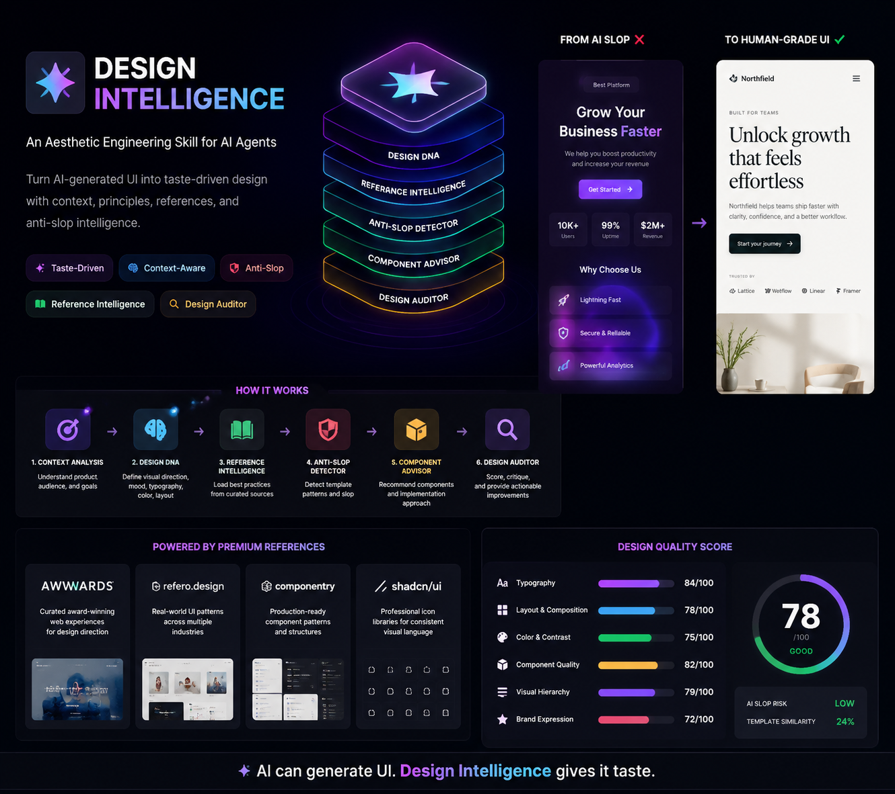

# Design Intelligence

An Aesthetic Engineering Skill for AI Agents (Antigravity, Claude Code, Codex) that turns UI generation into taste-driven design, critique,
and handoff.

This README is a companion to [SKILL.md](SKILL.md). The runtime behavior lives in `SKILL.md`; this
file explains the intent, structure, and operating model of the skill bundle.

---

## Problem Solved

AI coding agents can generate interfaces quickly, but they often drift into predictable slop:

- Generic SaaS templates
- Card addiction and repetitive feature grids
- Overused purple or neon gradients
- Emoji icons in place of actual iconography
- Weak typography, spacing, and hierarchy

`design-intelligence` adds a design judgment layer so AI coding agents can choose a visual direction before they
build or review UI.

The goal is not to lock the skill into one visual style. The goal is to make each output distinct in a
controlled way, so the result feels authored rather than templated.

---

## Installation

You can easily install this skill into your AI agent (like Antigravity, Claude Code, or Codex) using the standard skill installation tool:

```bash
# Install globally (for all your projects)
npx skills add -g https://github.com/RahmatHadinata23758051/SKILL-Design-Intelligence.git

# Install locally (for the current project only)
npx skills add https://github.com/RahmatHadinata23758051/SKILL-Design-Intelligence.git
```

---
## Core Promise

The skill should consistently do seven things:

1. Analyze the product context before choosing a visual direction.
2. Generate a `DESIGN DNA` before implementation.
3. Load only the references needed for the request.
4. Push the design away from generic templates and toward intentional composition.
5. Require one signature move so each output can differ without becoming random.
6. Detect visible anti-slop patterns with evidence, not vibes.
7. End every response with the canonical `DESIGN QUALITY SCORE`.

---

## Operating Model

The skill works as a compact design system for an AI agent:

- `Context Analyzer` - infer domain, audience, and product mood.
- `Design DNA Generator` - define typography, palette, layout, and motion direction.
- `Reference Intelligence` - pull only the relevant design principles and patterns.
- `Anti-Slop Detector` - catch template similarity, card addiction, gradient abuse, and emoji UI.
- `Distinctiveness Gate` - ensure each result has one signature move and one meaningful deviation.
- `Component Advisor` - translate the direction into build-ready decisions.
- `Design Auditor` - review implementations and report issues in a structured way.

---

## Workflow

The execution sequence is intentionally narrow:

1. Classify the request as `design`, `audit`, `iterate`, or `handoff`.
2. Load `knowledge/workflow.md`, the scoring template, anti-slop rules, and one domain pattern.
3. Read only the supporting principles that matter for the request.
4. Emit a single `DESIGN DNA` block.
5. Give implementation guidance or critique findings.
6. Finish with the exact `DESIGN QUALITY SCORE` block from `knowledge/scoring/design-score.md`.

This structure is meant to keep the agent decisive instead of drifting into generic design advice.

---

## Knowledge Architecture

```text
skills/design-intelligence/
├── SKILL.md
├── README.md
├── agents/
│   └── openai.yaml
└── knowledge/
    ├── workflow.md
    ├── scoring/
    │   └── design-score.md
    ├── anti-slop/
    │   ├── cards.md
    │   ├── emoji.md
    │   ├── gradients.md
    │   ├── template.md
    │   └── typography-slop.md
    ├── design-principles/
    │   ├── accessibility.md
    │   ├── color.md
    │   ├── hierarchy.md
    │   ├── spacing.md
    │   └── typography.md
    ├── visual-patterns/
    │   ├── ecommerce.md
    │   ├── fintech.md
    │   ├── healthcare.md
    │   ├── premium.md
    │   └── saas.md
    └── references/
        ├── awwwards.md
        ├── componentry.md
        ├── icons.md
        └── refero.md
```

The split is deliberate:

- `SKILL.md` stays procedural and compact.
- `knowledge/` stores the reusable design rules and domain-specific patterns.
- `agents/openai.yaml` gives the skill a stable identity in the UI.

---

## Trigger Phrases

Use this skill when the user asks for things like:

- "Design a landing page for this product"
- "Review this UI and tell me what feels off"
- "Detect AI slop in this mockup"
- "Buat layout premium yang tidak kelihatan template"
- "Translate this design direction into implementation guidance"

It should also trigger whenever the user is clearly asking for visual direction, layout critique, or
design system judgment on an existing UI.

---

## What Makes It Strong

The skill is designed to be stable, not just expressive:

- It uses one canonical score block, so outputs do not drift.
- It loads one primary visual pattern per request, so the context stays narrow.
- It requires a signature move, so separate briefs do not collapse into one repeated template.
- It treats accessibility as mandatory, not optional polish.
- It reports only observed issues during critique.
- It pushes the agent to make a single clear design decision instead of multiple competing directions.

---

## Output Contract

Every useful response from this skill should end with:

- a `DESIGN DNA` block when direction is needed
- implementation guidance or critique findings
- the canonical `DESIGN QUALITY SCORE` block

If a request is ambiguous, the skill should ask at most two short questions. If the direction is still
unclear, it should make the most reasonable premium assumption and state it explicitly.

---

## Usage

The skill is intended for design-heavy tasks where taste matters more than raw implementation speed.
It is most useful for:

- Marketing pages
- SaaS dashboards
- Product landing pages
- UI audits
- Design-to-code handoff guidance

For the actual execution rules, follow [SKILL.md](SKILL.md). For the reusable pattern library, read
the relevant files inside `knowledge/`.
